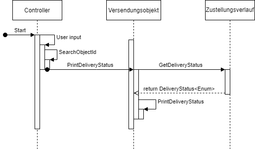
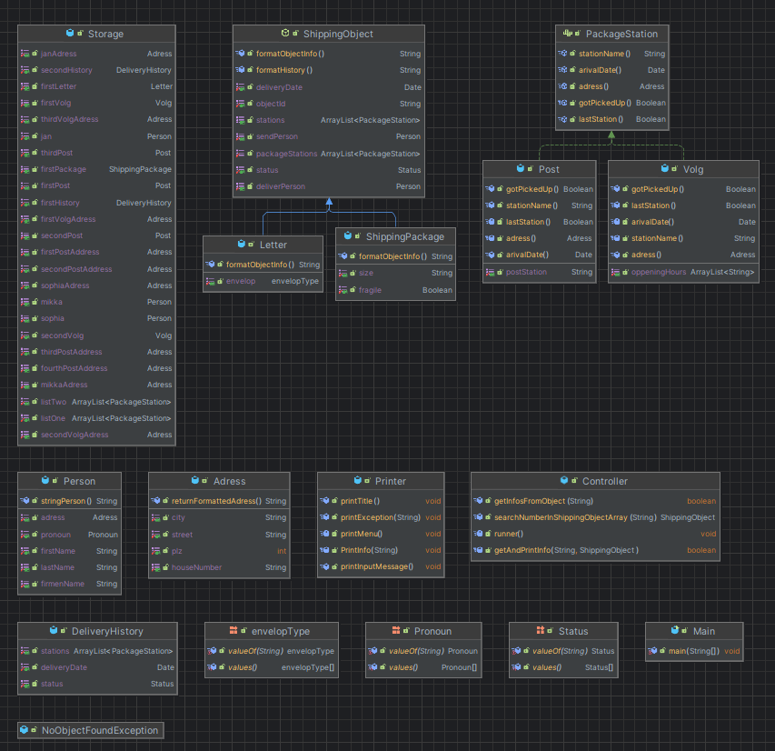

# Dokumentation K08

## Projekt
Dieses Projekt soll eine Sendungsverfolgung von Paketen und Briefen Simulieren. 
Mithilfe der Sendungsnummer eines Objekts, kann man den Sendeverlauf sehen. Ebenfalls kann man Informationen für das Objekt erhalten.
Dazu soll ein Menü in der Konsole dienen.

**Beispiel:**
1. User gibt die Id eines objekts ein oder kann das Programm beenden(In diesem Fall gibt er eine Id ein)
2. Id wird gesucht (In diesem Beispiel existiert das Objekt mit der Id)
3. Menu mit Optionen wird ausgegeben
4. User Input mit der gewählten Option (In diesem Fall der Status)
5. Der Status wird über das Objekt geholt
6. Der Status wird an eine Methode gegeben, welche die Daten formatiert und dann ausgibt
7. Der User kann das Programm beenden oder den Vorgang wiederholen (Natürlich auch mit einer anderen Id und oder einer anderen Optionswahl)

## Klassendiagramm
Für dieses Projekt habe ich zuerst ein Klassendiagramm erstellt um festzulegen, wie die verschiedenen Klassen miteinander Verbunden sind.

Was wichtig zu erwähnen ist ist, dass gewisse Attibute hinzugekommen sind oder auch entfernt wurden. Genau wie das Versandhaus wurde nicht implementiert, weil es hier nur als Beispiel gedient hat.

 

## Sequenzediagramm
In dem Sequenze Diagramm wurde ein Ablauf dargestellt, welchen ich implementiert habe.

Hier wird ein prozess visualisiert, in welchem ein objekt über die ID gesucht wird und danach wird der status dieses Objekts ausgegeben. Für diesen Prozess sind folgende Methoden nötig.

 

## Projekt implementation

*Hier ist eine visualisierung meiner Implementation:*

 

## Reflexion
Ich finde ich habe mich eigentlicg gut an meinen Ursprünglichen Plan gehalten. Ich habe noch zusätzliche Klassen und Methoden implementiert. Dies sieht man im Oberen Bild. Jedoch dient die Storgae Klasse nur als eine Art Datenbank, in welcher einfach alle Daten sind. In der Controller Klasse wird einfach der Prozess gesteuert und die Printer Klasse dient nur für Outputs. Die Zusätzliche Methoden dienen meistens nur zur Formatierung oder Validierung von Userinputs. Dieses Projekt war zwar nicht wirklich kompliziert hat mir jedoch geholfen Java malwieder gründlich zu repetieren. Natürlich kamen noch neue Variablen dazu oder die Namen der Variablen haben sich geändert, aber das Konzept ist gleich geblieben. Ich habe noch eine Zusätzliche Klasse hinzugefügt für meine costum Exception, diese habe ich jedoch auch nicht in das Klasendiagramm hinzugefügt, weil es für mich nicht dazu gehört, genau wie der Controller ect. Das Main dient in meinem Projekt nur noch um die Methode "runner" im Controller aufzurufen, der Rest wird im Controller gehandlet. 