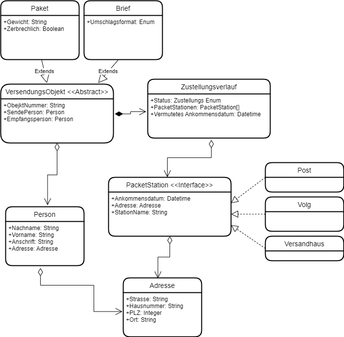

# Dokumentation K08

## Projekt
Dieses Projekt soll eine Sendungsverfolgung von Paketen und Briefen Simulieren. 
Mithilfe der Sendungsnummer eines Objekts, kann man den Sendeverlauf sehen. Ebenfalls kann man Informationen für das Objekt erhalten.
Dazu soll ein Menu in der Konsole dienen. 

## Klassendiagramm
Für dieses Projekt habe ich zuerst ein Klassendiagramm erstellt um Festzulegen, wie die verschiedenen Klassen miteinander Verbunden sind.

